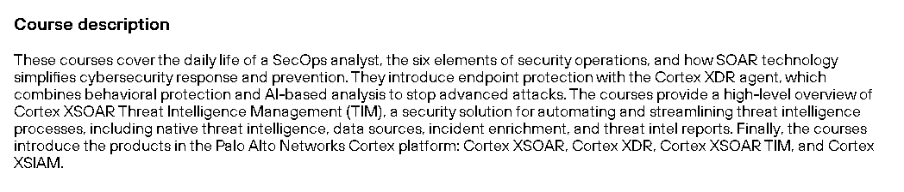
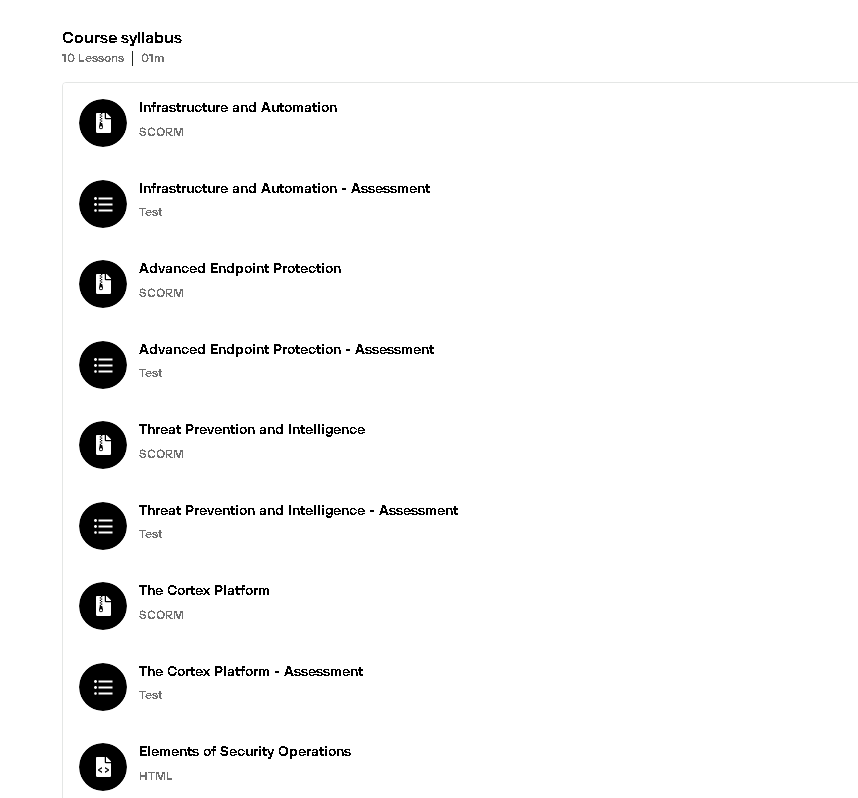

# 🛡️ Security Operations Fundamentals – Palo Alto Networks

This repository contains structured notes, hands-on demos, SOC playbooks, and certification proof from the **"Security Operations Fundamentals"** course by **Palo Alto Networks**.  
The course emphasizes core SOC workflows, SIEM alerting, threat response, and operational maturity.

---

## 📜 Certificate

- 🎓 [`Security Operations Fundamentals – Palo Alto`](./cert/security-operations-paloalto-certificate.png)

---

## 📒 Topics Covered

- 🧠 SOC Roles & Workflow Overview  
- ⚙️ Event Correlation & Detection  
- 🚨 SIEM Alerts & Triage  
- 🛡️ Threat Response Lifecycle  
- 🗂️ Playbook Automation Principles

---

## 📂 Repository Structure

| Folder        | Description |
|---------------|-------------|
| `notes/`      | Markdown notes for each module |
| `demo/`       | CLI, JSON, or platform-based simulation of alert triage |
| `strategy/`   | SOC-level playbooks and escalation models |
| `screenshots/`| Course visuals, completion proof |
| `cert/`       | Certificate of course completion |
| `LICENSE`     | GNU AGPLv3 license details |
| `DISCLAIMER.md` | Responsible usage declaration |

---

## 📘 Notes

- [`soc-overview.md`](./notes/soc-overview.md)  
- [`event-correlation.md`](./notes/event-correlation.md)  
- [`siem-and-alerts.md`](./notes/siem-and-alerts.md)  
- [`threat-response.md`](./notes/threat-response.md)

---

## 💻 Demo

- [`siem-rule-tuning.md`](./demo/siem-rule-tuning.md) – Sample SIEM alert rule optimization  
- [`soar-playbook-example.md`](./demo/soar-playbook-example.md) – SOAR-style automation logic  
- [`threat-response-scenarios.md`](./demo/threat-response-scenarios.md) – Sample threat response flows

---

## 🧠 Strategy

- [`incident-escalation-framework.md`](./strategy/incident-escalation-framework.md) – Triage, severity classification, and escalation model

---

## 📸 Screenshots

| Description | Screenshot |
|-------------|------------|
| 📝 Course Description |  |
| 📘 Course Portal View |       |

---

## 📝 Course Review

The *Security Operations Fundamentals* course by Palo Alto is concise yet insightful, providing an overview of modern SOC workflows, alert pipelines, and operational KPIs. While not tool-deep, it’s platform-agnostic and ideal for learners building situational awareness.

### ✅ What I Liked

- Structured content with practical case mappings  
- Emphasis on alert quality over volume  
- Encouragement of playbook-based SOC design

### 📌 What Could Be Improved

- Add interactive SIEM/EDR hands-on labs  
- Expand on threat intel and automation scripting (e.g., Python SOAR)

---

## 📎 Ideal For

- Cybersecurity Students  
- SOC Tier 1–2 Analysts  
- Red/Blue Teamers seeking better understanding of detection ops

## ✍️ Author

**Thành Danh** – Pentester & Cybersecurity Research  

GitHub: [@ngvtdanhh](https://github.com/ngvtdanhh)  

Email: ngvu.thdanh@gmail.com

---

## 📄 License

This project is licensed under the **GNU AGPL v3.0**.  
See [`LICENSE`](./LICENSE) for full terms.

© 2025 ngvtdanhh. All rights reserved.
