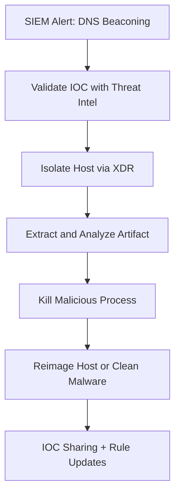

# 🚨 Threat Response – Security Operations Fundamentals (Palo Alto Networks)

> Effective threat response bridges detection and remediation. It includes verifying threats, understanding their scope, and executing mitigation actions quickly and confidently.

---

## 📌 1. What is Threat Response?

**Threat Response** is the structured set of actions taken by a security team after a threat or incident is detected.

It answers the following questions:

- 📍 **What happened?**
- 🧠 **Who/what was impacted?**
- 🚪 **How did it happen (entry vector)?**
- 🛡️ **What must we do to contain, eradicate, and recover?**

---

## 🧬 2. Core Steps in Threat Response

### 🔍 1. **Triage**
- Verify if the alert is a true positive
- Determine severity, affected systems, and attack phase

### 🧠 2. **Investigation**
- Use tools like SIEM, EDR, NDR, threat intel
- Pivot through logs, memory, file hashes, network traces

### 🔥 3. **Containment**
- Short-term: isolate host, block IP, disable account
- Long-term: patch vulnerabilities, deploy segmentation

### 🧽 4. **Eradication**
- Remove malware, reset passwords, close backdoors

### ♻️ 5. **Recovery**
- Rebuild systems if needed
- Monitor for re-infection or lateral movement

### 📜 6. **Post-Incident Review**
- Root cause analysis
- Update playbooks, rules, training
- Share IOCs with threat intel platforms

---

## 🛠️ 3. Example Tools Used in Threat Response

| Purpose              | Example Tools                         |
|----------------------|----------------------------------------|
| Triage               | Cortex XDR, Splunk, SentinelOne       |
| Log Search           | Elastic SIEM, Graylog, QRadar         |
| Containment          | SOAR platforms, Firewalls, NAC        |
| Malware Analysis     | Any.run, Cuckoo Sandbox, VirusTotal   |
| Threat Intel         | MISP, OpenCTI, Palo Alto AutoFocus    |
| Endpoint Analysis    | Velociraptor, Sysmon, Carbon Black    |

---

## ⚔️ 4. MITRE ATT&CK Alignment

Use ATT&CK framework to:

- Map adversary behavior (e.g., T1078 – Valid Accounts)
- Prioritize response actions per tactic (e.g., Persistence, Lateral Movement)
- Tag alerts and response flows consistently

---

## 💡 5. Best Practices for Threat Response

| Practice                             | Why It Matters                          |
|--------------------------------------|------------------------------------------|
| Use SOAR for repeatable actions      | Faster containment, less human error     |
| Automate enrichment (GeoIP, TI, etc.)| Contextual decisions, faster triage      |
| Tag artifacts for correlation        | Links similar cases, faster resolution   |
| Keep evidence snapshots              | Forensics, legal, post-mortem analysis   |
| Document everything                  | Ensures accountability and improvement   |

---

## 🎯 6. Threat Response Playbook Example

### Scenario: Malware Beaconing Detected



## 🔄 7. Feedback Loop

- Threat response is not linear. Always integrate what you've learned back into detection and defense layers.

Example:

- If phishing was the vector ➝ tighten email gateway rules

- If lateral movement occurred ➝ review AD permissions + segmentation

- If malware was undetected ➝ add YARA/sigma rules

## 📚 8. References

- Palo Alto – Security Operations Fundamentals

- NIST 800-61r2 – Computer Security Incident Handling Guide

- MITRE ATT&CK – Response and Mitigation Tags

- FIRST.org – Incident Response Best Practices

- CISA IR Guidelines – https://www.cisa.gov - https://www.cisa.gov/

## ✅ Summary

Threat response is a time-sensitive, intelligence-driven process. Strong collaboration between detection tools, IR teams, and automation platforms is essential for effective defense.

```yaml
“Detection without response is just noise. Response without structure is chaos.” – SOC Principle
```
